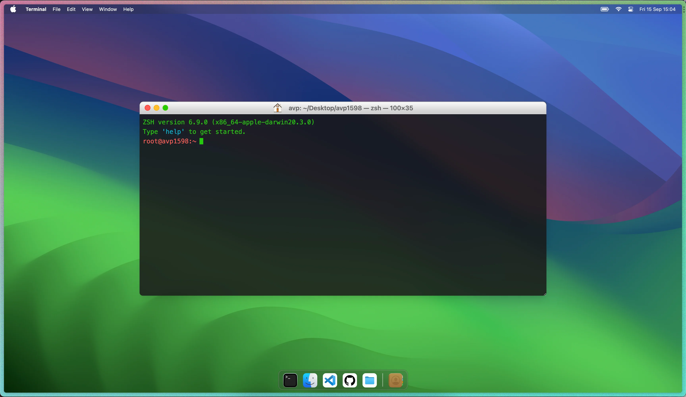

<h2 align="center">

 

<a href="https://avp1598.dev" target="_blank">avp1598.dev</a>

</h2>

 

  
  
  
  

Inspired from [boidushya.com](https://github.com/boidushya/boidushya.com)

## Lighthouse Scores

## Portfolio

<a href="http://avp1598.dev/"  target="_blank">avp1598.dev</a> made using
Astro.js, TailwindCSS and React, emulating a macOS terminal among other
features. 

This project was built using these wonderful tools:

- Astro

- TailwindCSS

- Typescript

- React

- React Spring

## Getting Started

Clone down this repository. You will need `node.js`, `yarn` and `git` installed
globally on your machine.

## 🛠 Installation and Setup Instructions

1. Installation: `yarn`

2. In the project directory, you can run: `yarn dev`

Runs the app in the development mode.

Open [http://localhost:4321](http://localhost:4321) to view it in the browser.

The page will reload if you make edits.

### Show your support

Give a ⭐ if you like this website and drop a follow/DM me on
[Twitter](https://twitter.com/ThePrincipalDev)!
